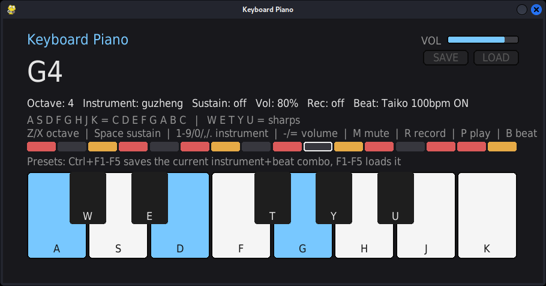

# Keyboard Piano

[](https://github.com/georgetruong88/keyboard-piano/actions/workflows/lint.yml)
[](https://github.com/georgetruong88/keyboard-piano/actions/workflows/build.yml)

Play musical notes with your laptop keyboard. A pygame/numpy synth with 13
instruments, a drum-beat sequencer, instrument+beat presets, note
recording/playback, and a DJ scratch layer — everything synthesized
procedurally, no audio samples.



## Requirements

- Python 3
- [pygame](https://www.pygame.org/) (`pip install pygame`)
- [numpy](https://numpy.org/) (`pip install numpy`)

## Run

```bash
python3 piano.py
```

Or use the included `keyboard-piano.desktop` launcher (edit the hardcoded
paths inside it first if you move the project).

## Controls

### Notes

| Keys | Plays |
|---|---|
| `A S D F G H J K` | C D E F G A B C (white keys, one octave) |
| `W E T Y U` | C# D# F# G# A# (black keys/sharps) |
| `Z` / `X` | shift octave down / up |
| `Space` (hold) | sustain — longer note decay |

### Instruments

| Key | Instrument |
|---|---|
| `1` | sine |
| `2` | square |
| `3` | sawtooth |
| `4` | triangle |
| `5` | guitar |
| `6` | drum synth (tuned/melodic percussion, not the beat sequencer) |
| `7` | pipa |
| `8` | guzheng |
| `9` | harmonica |
| `0` | dizi (Chinese bamboo flute) |
| `,` | electric fire guitar (overdriven/distorted) |
| `.` | DJ turntable scratch |

`/` fires a one-shot **scratch stab** that layers on top of whatever
instrument is currently selected and the backing beat, without switching
your active instrument — use it to punctuate a melody or beat with a scratch
hit instead of replacing your sound with `.`.

### Volume / mixing

| Key | Action |
|---|---|
| `-` / `=` | volume down / up |
| `M` | mute / unmute |

### Recording

| Key | Action |
|---|---|
| `R` | start/stop recording |
| `P` | play back the last recording |
| on-screen `SAVE` / `LOAD` buttons | persist a recording to `recording.json` next to the script, and reload it in a later session |

### Backing beat

| Key | Action |
|---|---|
| `B` | start/stop the backing beat |
| `N` | cycle beat pattern |
| `[` / `]` | tempo down / up |

Beat patterns: **Rock, Four on the Floor, Hip-Hop, Funk, Reggae, Trap**, plus
five epic/historical war-drum patterns — **Taiko, War March, Mongol Gallop,
Viking War Drum, Ottoman Mehter** — which use a louder, deeper drum voice
than the regular kit.

### Presets

| Key | Action |
|---|---|
| `Ctrl` + `F1`..`F5` | save the current instrument + beat pattern + tempo into that slot |
| `F1`..`F5` | load that preset (also persisted to `presets.json` next to the script) |

### Other

| Key | Action |
|---|---|
| `Esc` | quit |

## Notes

- `recording.json` and `presets.json` are generated at runtime next to
  `piano.py` and are gitignored — they're your local session state, not
  part of the source.

## License

[MIT](LICENSE)
