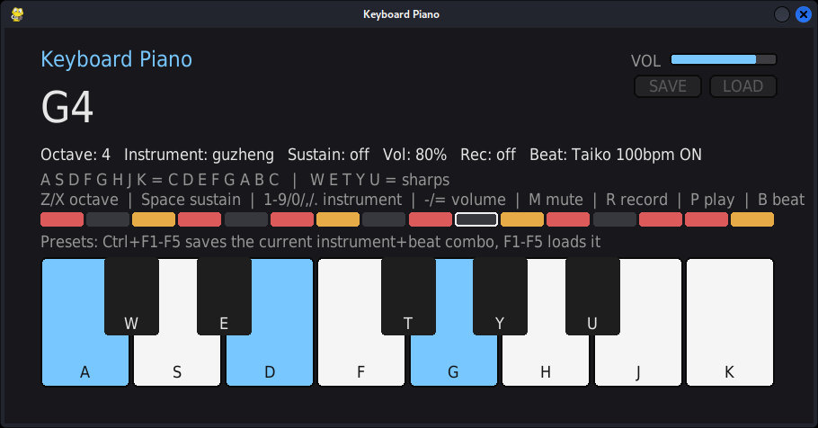

# Keyboard Piano

[](https://github.com/georgetruong88/keyboard-piano/actions/workflows/lint.yml)
[](https://github.com/georgetruong88/keyboard-piano/actions/workflows/build.yml)
[](LICENSE)
[](https://github.com/georgetruong88/keyboard-piano/actions/workflows/coverage.yml)

Play musical notes with your laptop keyboard. A pygame/numpy synth with 15
instruments, a drum-beat sequencer, instrument+beat presets, note
recording/playback, and a DJ scratch layer — everything synthesized
procedurally, no audio samples.



## Requirements

- Python 3
- [pygame](https://www.pygame.org/) (`pip install pygame`)
- [numpy](https://numpy.org/) (`pip install numpy`)

## Run

```bash
python3 piano.py
```

Or use the included `keyboard-piano.desktop` launcher (edit the hardcoded
paths inside it first if you move the project).

## Controls

### Notes

39 keys, low to high, spread across the keyboard in three rows plus a few
extra reach keys — like a compact 39-key mini keyboard:

| Keys | Register |
|---|---|
| `` ` `` `Z` `X` `C` `V` `B` `N` `M` `,` `.` `/` | low octave |
| `A` `S` `D` `F` `G` `H` `J` `K` `L` `;` `'` | mid octave |
| `Q` `W` `E` `R` `T` `Y` `U` `I` `O` `P` `[` `]` `\` | high octave |
| `Tab` `Enter` `Backspace` `Delete` | a few extra notes at the very top |

The on-screen keyboard is labeled with the exact physical key for every
note, white and black. Since almost every letter/punctuation key is now a
note, a few controls that used to be plain letters now need `Shift` held
(see below) so they don't collide with playing notes.

| Key | Action |
|---|---|
| `Up` / `Down` | shift the whole 39-key range up / down an octave |
| `Space` (hold) | sustain — longer note decay |

### Instruments

| Key | Instrument |
|---|---|
| `1` | sine |
| `2` | square |
| `3` | sawtooth |
| `4` | triangle |
| `5` | guitar |
| `6` | drum synth (tuned/melodic percussion, not the beat sequencer) |
| `7` | pipa |
| `8` | guzheng |
| `9` | harmonica |
| `0` | dizi (Chinese bamboo flute) |
| `F9` | electric fire guitar (overdriven/distorted) |
| `F10` | DJ turntable scratch |
| `F11` | accordion |
| `F12` | church pipe organ |

`Shift` + `/` fires a one-shot **scratch stab** that layers on top of
whatever instrument is currently selected and the backing beat, without
switching your active instrument — use it to punctuate a melody or beat
with a scratch hit instead of replacing your sound with `F10`.

### Volume / mixing

| Key | Action |
|---|---|
| `-` / `=` | volume down / up |
| `Shift` + `M` | mute / unmute |

### Recording

| Key | Action |
|---|---|
| `Shift` + `R` | start/stop recording |
| `Shift` + `P` | play back the last recording |
| on-screen `SAVE` / `LOAD` buttons | persist a recording to `recording.json` next to the script, and reload it in a later session |

### Backing beat

| Key | Action |
|---|---|
| `Shift` + `B` | start/stop the backing beat |
| `Shift` + `N` | cycle beat pattern |
| `Shift` + `[` / `Shift` + `]` | tempo down / up |

120 beat patterns in total, `Shift+N` cycles through all of them:

- **6 core kit patterns**: Rock, Four on the Floor, Hip-Hop, Funk, Reggae, Trap
- **59 genre/world/dance patterns**: funk & soul (P-Funk, Motown Groove, Go-Go, Neo Soul, New Orleans Second Line), Latin (Bossa Nova, Samba, Salsa, Cha Cha, Mambo, Merengue, Cumbia, Reggaeton, Tango, Bachata, Bolero), world (Afrobeat, Highlife, Soukous, Bhangra, Dabke, Balkan Brass, Klezmer, Flamenco Rumba, Irish Jig, Celtic Reel, Powwow Drum, Gqom, Amapiano, Dancehall, Baile Funk), electronic/dance (House, Techno, Trance, Drum and Bass, Jungle, Dubstep, Breakbeat, Big Beat, UK Garage, Industrial, EDM Festival, Downtempo, Trip-Hop, Synthwave, Electro), hip-hop (Boom Bap, Drill, Grime, Phonk, West Coast G-Funk, Jersey Club), and rock/metal (Punk Rock, Metal Double Bass, Blast Beat, Grunge, Arena Rock, Southern Rock, Glam Rock)
- **35 epic/dramatic/historical war-drum patterns**: Taiko, War March, Mongol Gallop, Viking War Drum, Ottoman Mehter, Roman Legion March, Spartan Phalanx, Zulu War Chant, Samurai Wadaiko, Norse Berserker Charge, Aztec War Drum, Celtic Battle Drum, Byzantine Cataphract, Persian Immortals, Hunnic Horde, Crusader Charge, Great Wall Siege, Highland Charge, Gladiator Arena, Titan's March, Apocalypse Drums, Thunder God's Wrath, Dragon's Roar, Final Battle Crescendo, Siege Engine, Imperial March, Warlord's Command, Berserker Frenzy, Doom Toll, Valkyrie Ride, Ragnarok, Colossus Awakens, Dark Lord's Drums, Phoenix Rising, Last Stand
- **20 ancient costume drama / wuxia action-soundtrack patterns**: Wuxia Sword Duel, Palace Intrigue, Assassin's Stealth, Imperial Procession, Ancient Battlefield Charge, Tragic Betrayal, Rebel Uprising, Emperor's Wrath, Forbidden City Chase, Martial Arts Showdown, General's Return, Night Raid, Court Execution, Dynasty's Fall, Heroic Sacrifice, Qin Dynasty March, Han Dynasty Cavalry, Tang Court Dance, Song Dynasty Siege, Three Kingdoms Battle

The epic/dramatic and costume-drama patterns use a louder, deeper drum voice
than the regular kit, and mostly drop the hihat entirely (real war-drum
ensembles didn't have one) — the snare doubles as a second drum voice for
rolls and accents. Pair them with the **pipa**, **guzheng**, or **dizi**
instrument (keys `7`/`8`/`0`) for the full costume-drama feel.

### Presets

| Key | Action |
|---|---|
| `Ctrl` + `F1`..`F5` | save the current instrument + beat pattern + tempo into that slot |
| `F1`..`F5` | load that preset (also persisted to `presets.json` next to the script) |

### Other

| Key | Action |
|---|---|
| `Esc` | quit |

## Tests

```bash
pip install pytest pytest-cov
pytest tests/ --cov=piano --cov-report=term-missing
```

Tests cover the pure-logic parts (pitch math, synthesis output, beat pattern
integrity, preset/recording persistence) headlessly via `SDL_VIDEODRIVER` /
`SDL_AUDIODRIVER` set to `dummy` in `tests/conftest.py`. The interactive
`main()` event loop itself isn't unit-tested — it's been exercised manually
by driving real keypresses through the actual event loop instead.

## Notes

- `recording.json` and `presets.json` are generated at runtime next to
  `piano.py` and are gitignored — they're your local session state, not
  part of the source.

## License

[MIT](LICENSE)
